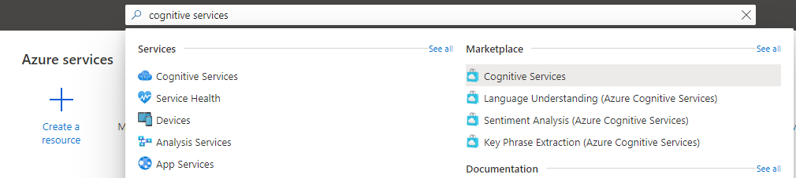
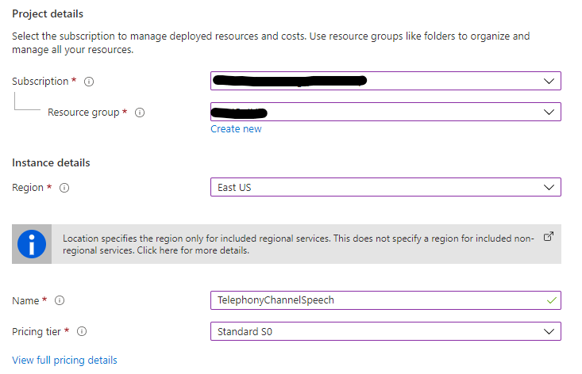

# Create a Cognitive Services resource

Now that you have the bot, we need to give it ability to understand human voice (speech-to-text) and speak (text-to-speech). For that that, you will create a Cognitive Services resource in Azure.

**Please note that currently Telephony Channel is only supported in West US 2 and East US Azure regions.**

Go to the [Azure portal](https://portal.azure.com), type "Cognitive Services" into the search bar at the top of the page, then select "Cognitive Services" under **Marketplace**:

You'll be prompted to provide some information:
   * For **Subscription**, choose the appropriate subscription.
   * For **Resource group**, select an existing resource group or create a new resource group.
   * For **Region**, choose East US or West US 2. Ideally, this should be same as the Bot's Azure region for best latencies. 
   * Give your resource a **Name** (for example, **TelephonyChannelSpeech**).
   * Select a **Pricing tier**.
   * Accept the Terms & Conditions.

After you've entered all required information, click **Review + create**. 

It may take a few minutes to create your resource. 

**Next step**:  [Enable Telephony as one of the channels in your bot](EnableTelephony.md)
