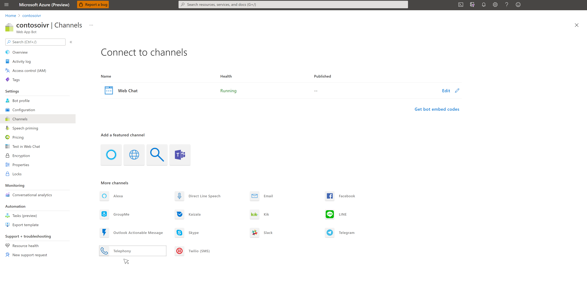

# Telephony Channel
Telephony Channel in Microsoft Bot Framework allows you to bind an existing PSTN phone number acquired using Microsoft Teams Phone System with a Bot in Microsoft Bot Framework.

Telephony channel under the hood is built upon Microsoft Speech Services to allow Speech to Text and Text to Speech capabilities crucial for enabling an audio interaction/conversation over phone lines.

Please follow these steps to enable a Telephony channel for your bot.

## Enable Telephony Channel in the bot

Once we have created a speech resource, we are ready to use it and configure it using the information collected in previous sections.

Go to the [Azure portal](https://portal.azure.com) > Bot (Created in previous [step](CreateBot.md)) > Channels

Click on the Telephony channel:

Configure the channel with following information:

* Telephony number - Acquired previously in [provisioning a new phone number for your bot in Azure Communication Services](https://docs.microsoft.com/en-us/azure/communication-services/quickstarts/telephony-sms/get-phone-number).
* Azure Communication Service Access Key and Endpoint - Acquired while [creating a Azure Communication Services Resource](https://docs.microsoft.com/en-us/azure/communication-services/quickstarts/create-communication-resource).
* Cognitive Service Subscription account created during [Cognitive Service account creation](CreateSpeechResource.md).

Click **Save**.

