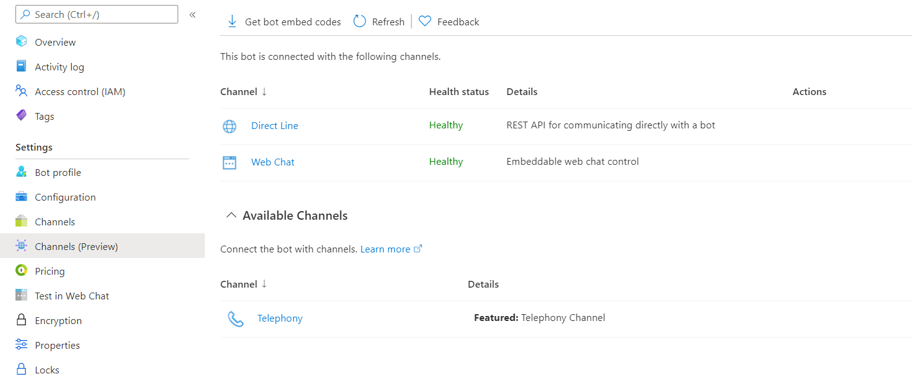
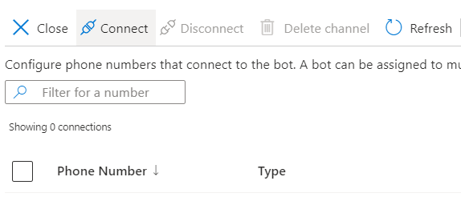
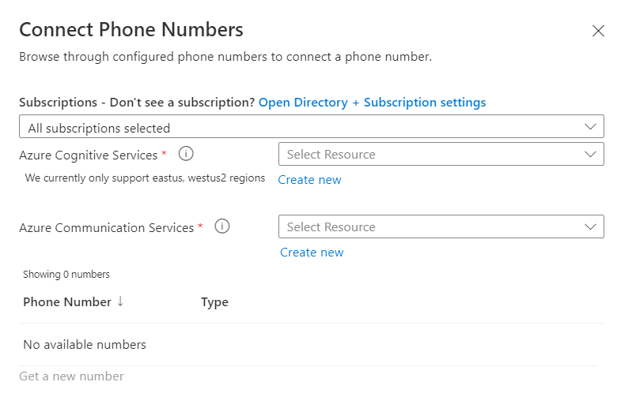
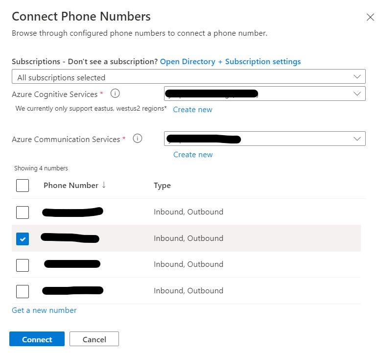
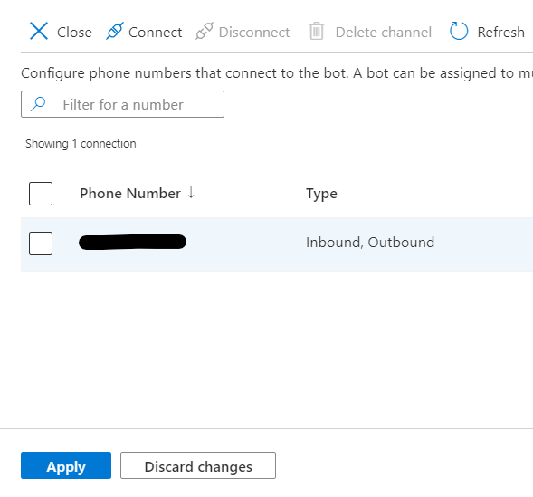

# Telephony Channel
The Telephony channel in Microsoft Bot Framework allows you to bind an Azure Communication Services' PSTN phone number with a Microsoft Bot Framework bot.

The Telephony channel under the hood is built on Microsoft Speech Services to allow Speech to Text and Text to Speech capabilities crucial for enabling an audio interaction/conversation over phone lines.

Please follow these steps to enable the Telephony channel for your bot.

## Pre-requisites
* [Step 1: Create a new bot](CreateBot.md). You can skip this step if you already have a working bot.
* [Step 2: Get an Azure Communication Services Resource](https://docs.microsoft.com/azure/communication-services/quickstarts/create-communication-resource) and [acquire a phone number in it](https://docs.microsoft.com/azure/communication-services/quickstarts/telephony-sms/get-phone-number).
* [Step 3: Create an Azure Cognitive Services Resource](CreateCogSvcsResource.md). Please note that Telephony is currently supported in WestUS2 and EastUS regions.

## Enable web sockets
You will need to make a small configuration change so that your bot can communicate with the Telephony channel using web sockets. Follow these steps to enable web sockets:

1. Navigate to the Azure portal > App Service hosting your bot > Configuration (in the left navigation pane) > open `General Settings` tab.
1. Locate the toggle for Web sockets and set it to `On`.
1. Click Save.
1. In addition to this, ensure your bot code have enabled communication over web socket, for example in `dotnet` it is `app.UseWebSockets();` in `Startup.cs`.

## Enable the Telephony channel in the bot

Once you have created an Azure Cognitive Services and Azure Communication Services resource, you are ready to configure Telephony.

1. Go to the [Azure portal](https://portal.azure.com) > Select the bot (Created in previous [step](CreateBot.md)) > Channels (Preview)

    

1. Select the Telephony channel
1. Select Connect in the command bar

    

1. In the "Connect Phone Numbers" pane, make sure you have the correct subscriptions selected, then choose an Azure Cognitive Services resource and an Azure Communication Services resource.

    

1. Select one or many phone number(s) to connect to your bot, then select Connect

    
    
    - Repeat this step for any additional Azure Communication Service resources you'd like to connect.

1. Select Apply to save your changes and connect the selected number(s) to the bot.

    

### If you experience any issues, please use the pre-existing [Channels blade](EnableTelephonyLegacy.md).