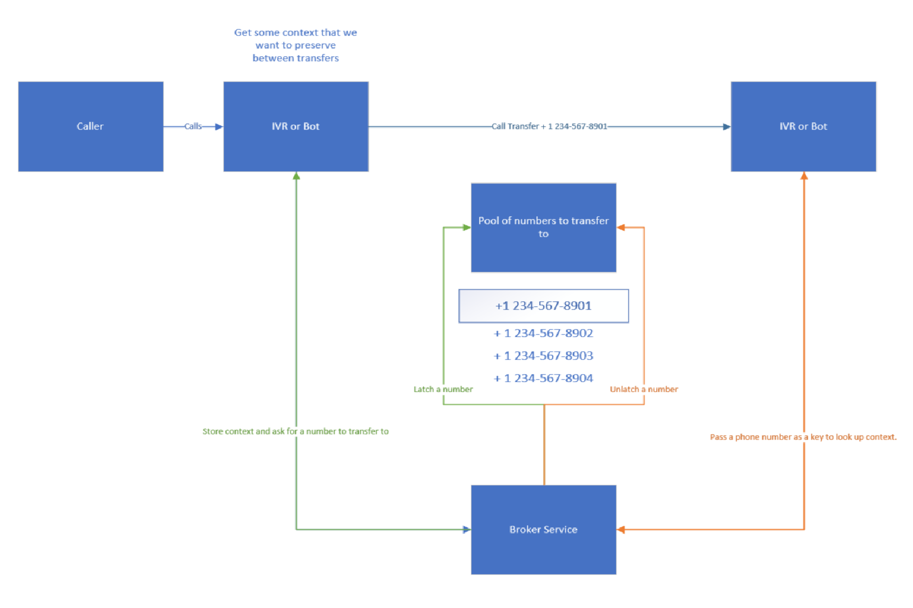

# Extending call transfer with context using the number pooling method

After successfully getting a call to transfer using the method described in [TransferCallOut](TransferCallOut.md), you might wish to extend the bot further and preserve the context that the bot has collected before landing on an agent, so that the agent only has to do the minimum verification to guarantee the identity of the user, rather than requesting the same information multiple times.

## The parts at play

The idea behind using the number pooling method is that while the number that is being called from cannot be reliably determined over a PSTN line (due to number spoofing or anonymous calling), the number that is reached is reliable.

By reserving a phone number from a pool of number on transfer, and storing the context keyed on that number, when the target of the transfer receives the call on that number, they can then look up the context reliably.

This however, is not a completely foolproof method. There exists a chance, however small, that a secondary caller manually calls and lands on the pooled number right after the transfer has been initiated. It is thus necessary to authenticate the caller. This can be done, for example, by asking the caller to provide information that only that caller would have.

## Example

Let's dive into a quick example:
It all starts with our caller. They call the bot, and begin a conversation where they share some key details about their account with the bot. The bot identifies that it needs to transfer this user to an agent on the traditional IVR service.

First, the bot will reach out to the broker service and request a phone number in exchange for the context the bot wishes to store.

Having received a phone number (let's call it +1 2345678901), the bot can then transfer the call to this number. This phone number is locked/latched for the duration of the transfer, so there will only ever be one context associated with it.

On the other end of the line, the IVR system recieves a call on +1 2345678901. They make an API call to the broker service, passing this number as a key. In exchange they receive the context that the bot initially passed in. The phone number is then released back to the pool of numbers to transfer to.

After populating the agent's view with the context the bot had collected, the agent can authenticate the incoming caller and utilize the context received from the bot.
