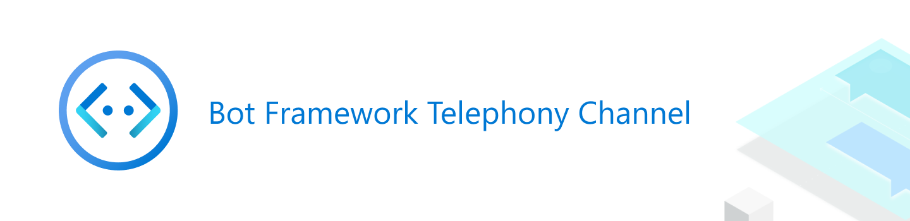

<!--  -->

  

### [Find out what's new with Bot Framework](https://github.com/microsoft/botframework-sdk)

# Bot Framework Telephony Channel

**Telephony channel** is a channel in Microsoft Bot Framework that enables the bot to interact with users over the phone. It leverages the power of [Microsoft Bot Framework](https://dev.botframework.com) combined with the [Azure Communication Services](https://azure.microsoft.com/en-us/services/communication-services) and the [Azure Speech Services](https://azure.microsoft.com/en-us/services/cognitive-services/speech-services). Telephony Channel is currently in Public Preview, available broadly for the US-based Azure subscriptions. If you have general questions about Public Preview, you can reach us at [telephony-preview@microsoft.com](mailto:telephony-preview@microsoft.com). 
 
 ---
__Please note__:  This is a Beta (preview) version of software, and as with any preview software, there may be initial risks and limitations you run into, such as a need to integrate with your existing IVR, etc. We are working on and supporting this product and are here to help you in case you run into any issues. Submit an issue [here](https://github.com/microsoft/botframework-telephony/issues).

---

## Documentation and samples

* **Getting started**. Are you ready to build a bot that answers phone calls? Follow these four easy steps:

  * [Step 1: Create a new bot](CreateBot.md). You can skip this step if you already have a working bot.
  * [Step 2: Get an Azure Communication Services Resource](https://docs.microsoft.com/en-us/azure/communication-services/quickstarts/create-communication-resource) and [acquire a phone number in it](https://docs.microsoft.com/en-us/azure/communication-services/quickstarts/telephony-sms/get-phone-number).

  * [Step 3: Create a speech resource](CreateSpeechResource.md). You need an instance of the Speech Service to convert speech to text (for messages _received_ by the bot) and text to speech (for messages _sent_ by the bot)
  * [Step 4: Configure the Telephony channel](EnableTelephony.md). This step connects it all together.

  Once setup, you should be able to dial the acquired phone number using any phone and hear your bot echo your voice. If you hear that, congratulations! You're ready for dive deeper for more advanced features.

* [**Telephony features.**](AdvancedFeatures.md) Explore how to build advanced bots that take advantage of advanced telephony features.
* [**Roadmap.**](roadmap.md) Explore what's coming up next.
* [**Samples.**](Samples.md) Learn from our samples.

## Feedback

File a bug or suggestion in [GitHub Issues](https://github.com/microsoft/botframework-telephony/issues).

## Limitations
Currently, Telephony channel has some regional and capabilities limitations.

* Azure Communications Service is currently limited to offering PSTN numbers only for US billed customers to acquire US phone numbers.
* Azure Communications Service currently does not support free, trial or Visual Studio benefits subscriptions.
* Telephony Speech is only available in WestUS2 and EastUS, and so, please create your Cognitive Services key in one of those regions.
* `en-US` is set as the default locale on the Telephony channel, this can be changed from within the bot or you can reach out to us at [telephony-preview@microsoft.com](mailto:telephony-preview@microsoft.com) to change the default locale for your bot.

We working to remove these limitations as soon as possible. For feature roadmap, please refer to [**Roadmap.**](roadmap.md)
## Contributing

This project welcomes contributions and suggestions.  Most contributions require you to agree to a
Contributor License Agreement (CLA) declaring that you have the right to, and actually do, grant us
the rights to use your contribution. For details, visit https://cla.microsoft.com.

When you submit a pull request, a CLA-bot will automatically determine whether you need to provide
a CLA and decorate the PR appropriately (e.g., label, comment). Simply follow the instructions
provided by the bot. You will only need to do this once across all repos using our CLA.

This project has adopted the [Microsoft Open Source Code of Conduct](https://opensource.microsoft.com/codeofconduct/).
For more information see the [Code of Conduct FAQ](https://opensource.microsoft.com/codeofconduct/faq/) or
contact [opencode@microsoft.com](mailto:opencode@microsoft.com) with any additional questions or comments.

## Reporting Security Issues

Security issues and bugs should be reported privately, via email, to the Microsoft Security Response Center (MSRC) at [secure@microsoft.com](mailto:secure@microsoft.com). You should receive a response within 24 hours. If for some reason you do not, please follow up via email to ensure we received your original message. Further information, including the [MSRC PGP](https://technet.microsoft.com/en-us/security/dn606155) key, can be found in the [Security TechCenter](https://technet.microsoft.com/en-us/security/default).

Copyright (c) Microsoft Corporation. All rights reserved.
